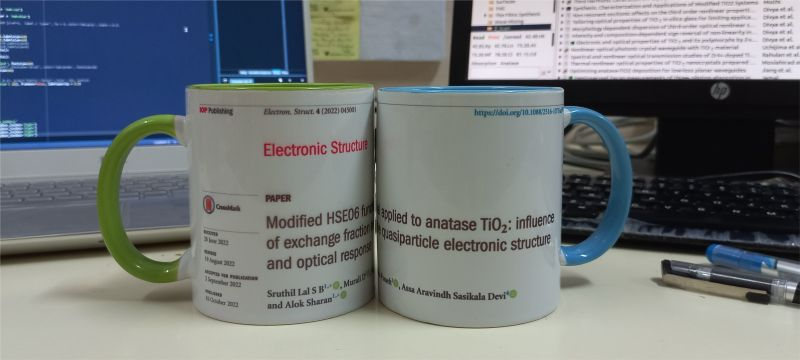

## Celebrating Small Wins
The paper went through countless revisions and many rejections before finding a venue for publication. As this work came to fruition, it brought significant personal and professional transformation—shoutouts to all who have been a part of this challenging but satisfying journey to fruition.

For the most part, I was battling self-doubt and writer’s block. Each time, I forced myself to read the draft one last time. By the hundredth time, I had learned my paper word by word by heart so that even embarrassing mistakes missed my eyes. Having seen no improvement, I lost interest many times and procrastinated. I re-challenged myself.

Putting the work in the context of the literature had its challenges. All papers felt so relevant that my web browser started screaming at me with about 200+ opened tabs. I had to make tough decisions to let everything go and start from scratch.

I tried many strategies to navigate each roadblock, negotiating turns and twists. I enjoyed learning how fellow researchers worldwide have found their way through. It has taken me a long way to optimize life and work, ultimately finding balance.
If I had to pick a few things that transformed me personally and professionally, this paper would be my first pick. I have become efficient at many things, including avoiding getting overwhelmed beyond control.

To cherish the achievement, as a reminder of energy and effort invested, as a testament of perseverance and more importantly, to have a sense of achievement, I am rewarding myself with this gift.

I know this experience is not something unique to me. Any budding researcher would have gone through this or currently going through it. It is a feeling many in academia can relate to. **It is also to remind my fellow researchers not to forget to celebrate small victories like this and to reward yourselves with such sweet little treats. Train yourselves to learn to enjoy the process, not just the results.**
