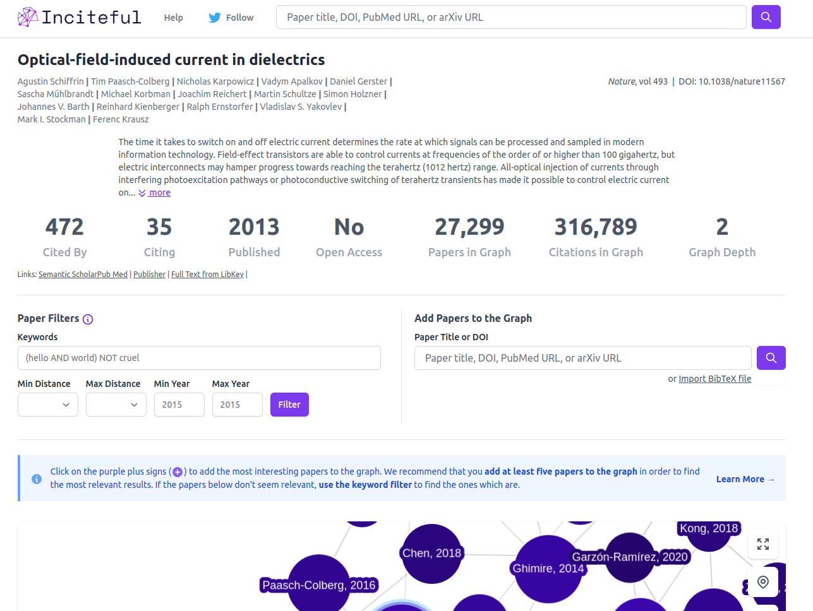

## Losing yourself in the sea of papers?
Reading research papers takes a lot of work. What is even more challenging is finding those papers that are more "relevant to us. I have had the terrible habit of forcefully reading papers from the title to the last line of the conclusion just before even deciding whether to keep or forgo them. It was a time when I felt all papers were necessary for my work and I should give it a read. With the pressure mounting to be on top of the latest developments, I signed up for email alerts from almost all publishers in the field. Someone should tell us all the papers that hit your inbox as alerts will not matter to you. We will only need some of those thousands of papers that pour into your inbox. 
Unfortunately, things were not going according to plan. Quite soon, the newbie's excitement of delving into the unknown jargon in the papers turned into exhaustion and desperation. I was slipping and losing to the sea of information. It is easy to slip into the sea of information, not getting anywhere far from the introduction of papers. 

**Here are some tools that will help you efficiently explore research literature, analyze their connections with other papers, asses their significance/relevance within the domain and get the gist of papers without thoroughly reading them.** Let these tools do the heavy lifting for you.
#### 1. [Researchrabbit](https://www.researchrabbit.ai/)

Suppose you have one paper to start with and want to find some more relevant papers [**Research Rabbit**](https://www.researchrabbit.ai/) could be the best place. Start by searching them with a title, identifier (DOI, PMID) or keywords and add them to a collection. It is also possible to search for papers by uploading a BibTeX or RIS file. If you are a [**Zotero**](https://www.zotero.org/) user, you can also import your entire Zotero collection. [**Research Rabbit**](https://www.researchrabbit.ai/) will generate a list of papers in the form of similar works, references cited in the chosen paper, and all citations. Interestingly, it will also show you a connection map showing the interconnection between the papers you just added to your collection, **giving you the overall context of the literature**. 

[**Research Rabbit**'s](https://www.researchrabbit.ai/) suggestion engine will keep suggesting papers based on your collection. You can filter the suggestions based on connection with other cited or related works, timelines, authors etc. If you find some papers exciting or relevant to you, organize them into other collections and ignore the rest. 

#### 2. [Connected papers ](https://www.connectedpapers.com/)
[**Connected papers**](https://www.connectedpapers.com/) is another tool that will help us explore the connected papers in a visual graph, arrange papers based on their similarity, and sort prior and derivative works.   

Similar to [**Research Rabbit**](https://www.researchrabbit.ai/, we can start by searching for papers, and Connected Papers will do the rest for you. It will build a graph of connected papers; you can save them if you find them relevant. 

#### 3. [Scite](https://scite.ai/home)
[**Scite**](https://scite.ai/home) is a *smart citation* index that displays the context of citations and classifies their intent using deep learning. It categorizes citations based on context. [**Scite**](https://scite.ai/home) shows how a citation was used by highlighting text associated with the citation and classifies based on whether it provides supporting or contrasting evidence for a referenced work. 

[**Scite**](https://scite.ai/home) has a web browser extension that how the research is cited anywhere, you are reading literature online. 

<!-- 
#### Open Knowledge Map 
A Knowledge Map presents you with a topical overview for your search query based on the 100 most relevant documents matching your query.

We use text similarity to create the knowledge maps. The algorithm groups those documents together that have many words in common.

The visualization is intended to give you a head start on your scholarly search. You can identify relevant areas at a glance and documents related to them. -->

#### 4. [Inciteful.xyz](https://inciteful.xyz/)
[Inciteful.xyz](https://inciteful.xyz/) helps to analyze the network of academic papers in a given collection to help you discover the most relevant literature. Start by adding papers to your collection by searching with title, DOI, or even importing a BibTeX file. Builds a graph of all connected papers, similar papers, a list highlighting the essential papers in the graph, top authors and top journals that are part of the graph just generated. 

<!--  -->

{}
All tools mentioned above will help us to sample relevant papers from a large pool of papers by establishing the connections between them. Next, how do we understand the content of those selected papers? Wouldn't it be easier to do that without opening and reading all the papers?!! Well, [**Scholarcy**](https://www.scholarcy.com/) is just for that. 
{}

#### 5. [Scholarcy Web Plugin](https://www.scholarcy.com/)
It is an AI-powered article summarizer. It provides a quick snapshot and summary of every paper to figure out which is the most important paper for you. Clicking the Scholarcy Web Plugin Scholarcy gives you the context without skimming through the paper. It gives you a synopsis of the work, highlights of the paper, and even a comparative analysis based on its content. You can save the time you otherwise take for reading the paper entirely for something more useful. 

Please try these tools and make them a part of your workflow. It will make your literature search less intimidating and tedious, making it exciting and fun. 